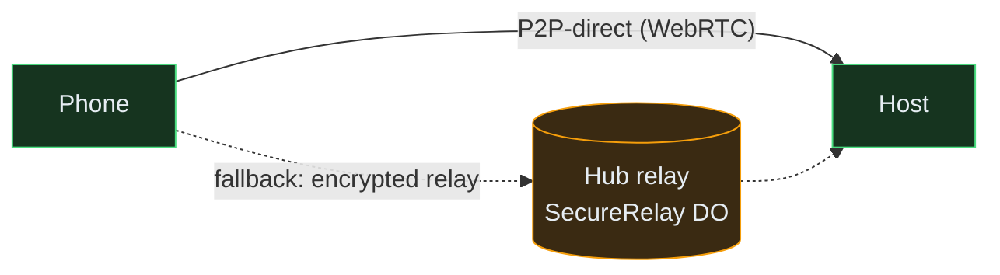
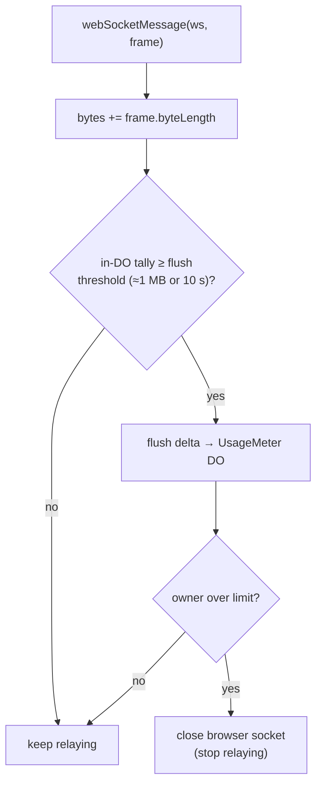
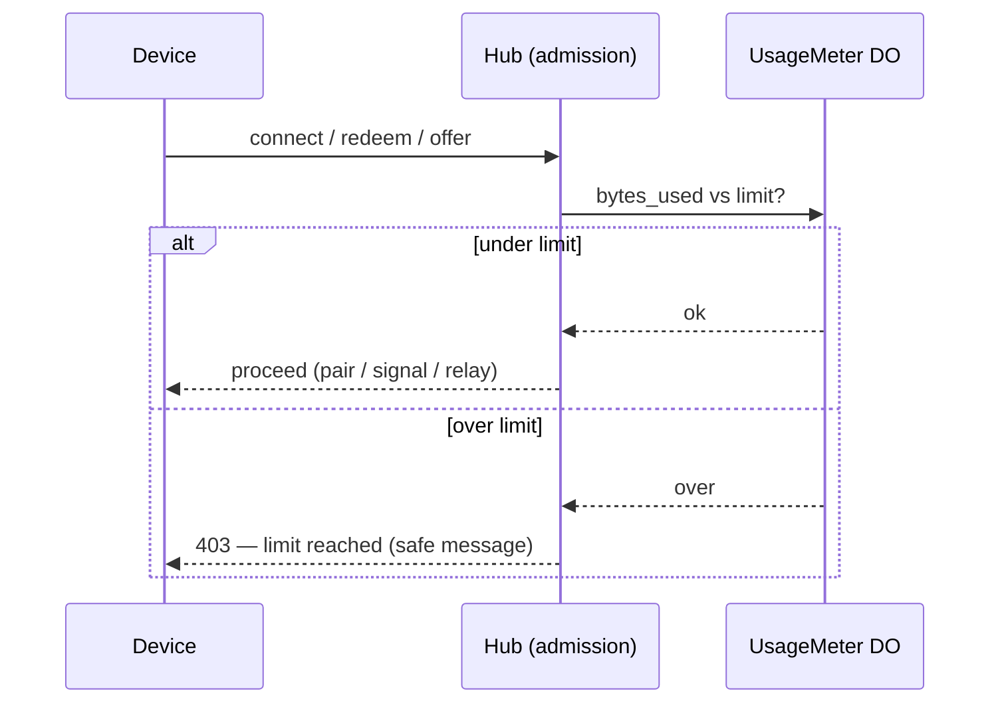

# Bandwidth Quotas — Per-Subscriber Metering & Connection Blocking

This page specifies how the hub **meters relayed bandwidth per subscriber** and
**blocks new connections once a subscriber exceeds their monthly limit**. It is
the basis for the hosted subscription model: a flat monthly price with a bounded,
enforceable cost ceiling per account.

!!! abstract "One-sentence summary"
    Only bytes that traverse the hub's **encrypted relay** are metered and capped;
    **peer-to-peer-direct** traffic never touches the hub, so it is free *and*
    invisible — which is why the cap is a hard gate on **new connection setup**
    (which the hub always mediates) rather than a mid-stream byte valve on traffic
    it cannot see.

## Why only relayed bytes are metered

A connection uses one of two transports (see [Connectivity](connectivity.md)):



| Transport | Path | Cloudflare cost | Metered? |
|---|---|---|---|
| **P2P-direct** | phone ⇄ host, never via hub | **$0** (no bytes traverse Cloudflare) | **No — invisible to the hub** |
| **Encrypted relay** (fallback) | phone ⇄ `SecureRelay` DO ⇄ host | DO **active duration** while relaying | **Yes — every frame is counted** |

!!! info "No TURN"
    openhort does **not** use TURN. When a direct NAT punch fails, the fallback is
    the hub's own **end-to-end-encrypted blind relay** (`SecureRelay`), not a
    third-party TURN server. The relay forwards ciphertext only — it cannot read
    the bytes it meters (see [Secure Pairing](secure-pairing.md)) — but it *can*
    count and cap them.

This is the crux: **the only bandwidth that costs money is relayed bandwidth, and
that is exactly the bandwidth the hub can see and meter.** P2P-direct is free, so
there is nothing to bill and nothing to cap.

## The metering hook

Every relayed byte passes through exactly one place — `SecureRelay.webSocketMessage`
in `securerelay.js`, which forwards frames between the browser socket and the host
socket:

```
relay ⇄ host    :  sid(16) || kind(1) || body
relay ⇄ browser :  kind(1) || body            (hub never reads `body`)
```

Metering counts the **frame byte length** in both directions at this hook. The
relay still never inspects the body — counting a length is not reading content.



### Why not write the counter per frame

A 4 Mbit stream is hundreds of frames per second. Writing the durable counter on
every frame would be a write storm and would hit KV's per-key write-rate limit.
Instead:

1. The `SecureRelay` DO keeps an **in-memory running tally** for its live sessions.
2. It **flushes a delta** to the durable per-owner counter periodically — every
   **~1 MB or ~10 s**, whichever comes first — and once more on session close.
3. The durable counter is a **`UsageMeter` Durable Object keyed by owner**
   (`idFromName(owner)`), which gives **atomic, consistent** increments across all
   of that owner's concurrent sessions. (KV is avoided here: it has no atomic
   increment and is eventually consistent, which is unsafe for a hard cap.)

## Data model

| Key / object | Shape | Purpose |
|---|---|---|
| `owner:{handle}` | `{ …, plan, bandwidth_limit_bytes }` | the subscriber's plan and derived monthly cap |
| `host_by_key:{key}` | `{ host_id, owner }` | maps a relay connection to the owner to meter |
| `UsageMeter` DO (`idFromName(owner)`) | storage: `{ period, bytes_used }` | atomic per-owner byte counter for the current period |

`period` is the billing window, formatted `YYYY-MM` (UTC calendar month by
default; can be anchored to the subscription's billing day — see
[Reset & billing alignment](#reset-billing-alignment)). The `UsageMeter` resets
`bytes_used` to `0` the first time it is touched in a new `period`.

!!! note "Plan → limit"
    `bandwidth_limit_bytes` is derived from `plan` via a small config map (e.g.
    `free → 0`, `pro → 100 GiB`). Storing the resolved number on the owner record
    lets a plan change take effect immediately without redeploying.

## Enforcement — two layers

Because the hub cannot see P2P-direct bytes, "block connection if exceeded" is
enforced where the hub *always* has control: **connection setup**. A device that
is over quota cannot establish a *new* session on **any** transport, because every
new session — P2P-direct included — needs the hub to broker pairing and signaling.

### Layer 1 — admission gate (hard block on new connections)

Before the hub brokers a new connection, it checks the owner's `UsageMeter`
against `bandwidth_limit_bytes`. If `bytes_used ≥ limit`, the request is refused:

| Setup step (hub-mediated) | Over-quota response |
|---|---|
| Pairing redeem `POST …/api/pair/redeem` | `403` — no new device credential issued |
| P2P signaling (offer admission / `sdp-send`) | `403` — host never answers, so no WebRTC session forms |
| Relay socket open (browser side of `SecureRelay`) | socket closed immediately with a policy close code |

Blocking all three means **no new session can form regardless of transport** while
the account is over quota — a true hard stop.



### Layer 2 — mid-session cutoff (stop an in-flight relay)

A long relay session can cross the limit *while streaming*. On each flush
(§ metering hook), the `SecureRelay` DO asks the `UsageMeter` whether the owner is
now over; if so it **closes the browser socket**, ending the relay. The overshoot
is bounded by the flush granularity (≈1 MB or ≈10 s of traffic), so a subscriber
can never run materially past their cap.

!!! warning "What Layer 2 cannot do"
    An already-established **P2P-direct** session carries no bytes through the hub,
    so the hub cannot meter it and **cannot cut it mid-stream**. This is acceptable
    by construction: that traffic **costs nothing**. The account is still blocked
    from forming *new* sessions (Layer 1), and direct sessions are re-brokered by
    the hub on every reconnect — at which point the block applies.

## User-facing behavior

Per the platform rule **never expose internal errors**, a blocked viewer sees a
safe, generic message only — never a quota internal, stack trace, or owner detail:

> *"This service has reached its limit for now. Please try again later."*

The **owner** (subscriber) sees the real picture on their dashboard:

- current `bytes_used / bandwidth_limit_bytes` and percentage for the period;
- the period reset date;
- pre-emptive warnings at **80%** and **95%** (so a block is never a surprise);
- a clear "limit reached — connections paused until `{reset_date}`" state.

## Reset & billing alignment

- **Default:** UTC calendar month. The `period` key flips at `00:00 UTC` on the
  1st; the `UsageMeter` zeroes `bytes_used` on first touch in the new period.
- **Billing-aligned (recommended for paid plans):** anchor `period` to the
  subscriber's billing day so the quota window matches what they pay for. Store
  the anchor day on the `owner` record; compute the current `period` from it.

!!! tip "Top-ups & plan changes"
    Raising `bandwidth_limit_bytes` (upgrade or one-off top-up) takes effect on the
    next admission check — a blocked subscriber is immediately un-blocked without a
    redeploy or a counter reset.

## Guarantees & edge cases

| Concern | Behavior |
|---|---|
| **Overshoot past the cap** | Bounded by flush granularity (~1 MB / ~10 s). Never unbounded. |
| **Concurrent sessions, one owner** | All flush to the same per-owner `UsageMeter` DO, which serializes increments — the cap is global to the account, not per-session. |
| **Counter durability** | `UsageMeter` uses DO **storage** (survives eviction/restart), not in-memory state. |
| **P2P-direct bytes** | Not counted (invisible, free). New direct sessions are still gated at signaling. |
| **Clock / period boundary** | The flush pins to the `period` computed at flush time; a session spanning the boundary splits cleanly across two periods. |
| **Free plan (`limit = 0`)** | Every relay admission is blocked, but P2P-direct still works — a free tier that costs the platform nothing. |
| **Metering ≠ decryption** | Only frame *lengths* are summed; the E2E body is never read, preserving the [blind-relay threat model](secure-pairing.md). |

## Implementation map

| Concern | Where |
|---|---|
| Count relayed frame bytes | `SecureRelay.webSocketMessage` — `securerelay.js` |
| Per-owner atomic counter | new `UsageMeter` Durable Object — `usagemeter.js` |
| Connection → owner mapping | `host_by_key:{key}` gains `owner` — `index.js` / `publish.js` |
| Admission checks (redeem / signal / relay-open) | `handlePublishRequest`, relay/securerelay entry — `publish.js`, `relay.js`, `securerelay.js` |
| Plan → limit, dashboard usage read | `owner:{handle}` + a usage read endpoint — `publish.js`, `index.js` |

!!! note "Status"
    This page is the **design spec**. The metering hook, `UsageMeter` DO, and
    admission gates are implemented against it; P2P-direct remains unmetered by
    design (it is free and never traverses the hub).
