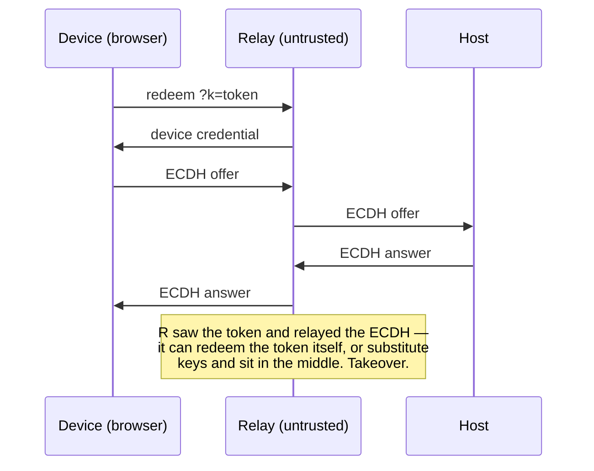
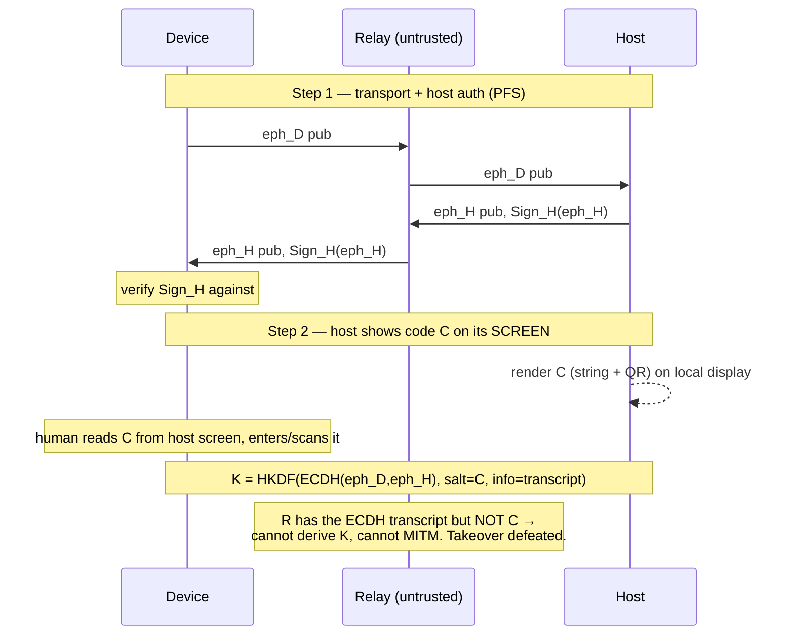
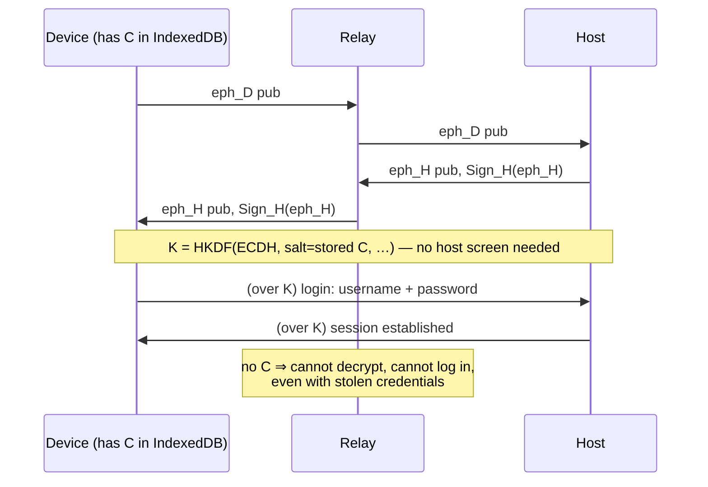
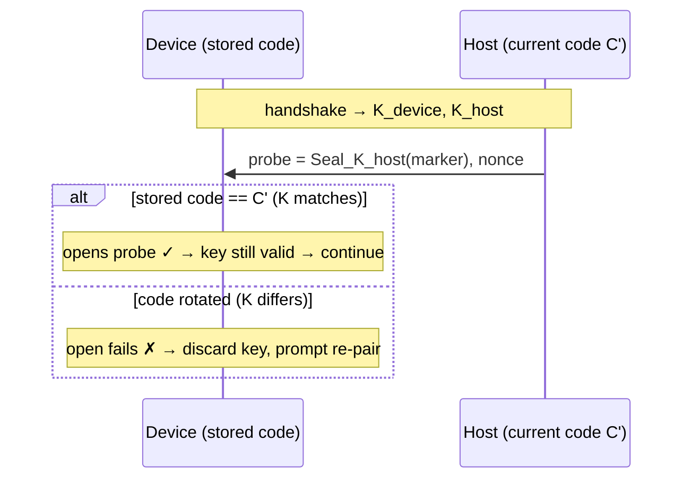

# Secure Pairing — Two-Step, Host-Screen-Bound Connections

This page documents the **two-step pairing** model that makes a published llming
app safe to expose through an **untrusted relay** — including the openhort hub.
It applies identically to the **P2P** (WebRTC DataChannel) and **Proxy /
encrypted-relay** transports.

!!! danger "Threat model: the relay is the adversary"
    We assume the relay/hub sees and can **modify 100% of the traffic** — it is
    the signaling channel *and* the fallback data path. The security goal is that
    a fully-malicious relay can **neither read, MITM, nor take over** a session,
    even though every byte passes through it.

## Why one-step pairing is not enough

The original flow paired a device with a single token in the URL
(`…/{owner}/{app-path}?k=<token>`):

Two holes:

1. **The pairing token passes through the relay** (redeem is a server call), so the
   relay can redeem it and pair *as the device*.
2. **The ECDH is relay-mediated.** The `#hk` host-key fingerprint (carried
   out-of-band in the QR's URL *fragment*, which is never sent to a server)
   authenticates **host → device** — but nothing authenticates **device → host**
   or binds the channel to a secret the relay cannot observe. The relay can
   substitute keys and MITM.

## The fix: a second factor that only the host screen shows

The relay can see everything on the wire — but it **cannot see the host's
physical screen**. So we introduce an out-of-band confirmation the relay can
never observe:

> **Step 1 — Transport + host auth.** Connect via the QR (P2P or proxy). Pin the
> host key from `#hk`. Run an **ephemeral×ephemeral** ECDH (forward secrecy); the
> host's ephemeral key is signed by its pinned long-term identity key.
>
> **Step 2 — Channel binding.** The moment a device tries to connect, the **host
> displays a fresh high-entropy pairing code `C` on its own screen** (as a
> copy-pastable string *and* a QR). The user reads `C` off the host screen and
> enters or scans it on the device. `C` is mixed into the session-key
> derivation. **The relay never sees `C`, so it cannot derive the key or MITM.**

## Cryptographic construction

| Element | Value |
|---|---|
| Host identity key `H` | long-term P-256; fingerprint pinned via `#hk` (QR fragment, out-of-band) |
| Per-session keys | host ephemeral `eph_H` (**signed by `H`**) + device ephemeral `eph_D` → forward secrecy |
| Pairing code `C` | 128-bit random, **base32** (copy-pastable) and rendered as a QR; shown on the host screen on each connect attempt |
| Session key | `K = HKDF(IKM = ECDH(eph_D, eph_H), salt = SHA256(C), info = pin ‖ eph_D.pub ‖ eph_H.pub)` |
| Record cipher | AES-256-GCM, 96-bit random nonce per message |

Properties:

- **Confidentiality + forward secrecy** — ephemeral×ephemeral ECDH; a later key
  compromise does not decrypt past sessions.
- **Host authentication** — `eph_H` is signed by the pinned identity `H`; a relay
  cannot substitute the host's key.
- **Channel binding / anti-takeover** — `K` depends on `C`, which the relay never
  sees. A relay that substitutes `eph_D` toward the host ends up with a *different*
  key on each side and **lacks `C` to derive either** → it can disrupt (DoS, which
  any wire-controlling relay can always do) but **cannot read or impersonate**.
- **Transcript binding** — `info` includes the pinned key and both ephemeral
  public keys, preventing unknown-key-share / reflection.
- **Offline-attack resistance** — `C` is high-entropy (128-bit), so a relay that
  records the transcript cannot brute-force `C`. (A low-entropy PIN would require
  a true PAKE; the copy-pastable code lets us use a strong secret instead.)

## Persistence & re-authentication

The pairing code `C` **is the device's durable "decryption key."**

- On first pair, the device stores `C` (and the host pubkey) in **IndexedDB**.
- **Only with `C`** can the device derive `K` — i.e., decrypt traffic *or* log in.
- To **re-initiate a session later**, the device uses its stored `C` to derive `K`
  with the host (no host-screen step needed), then authenticates the human with
  **username + password** over the encrypted channel.
- The **transport pairing token** (`?k=`) is **short-lived (24 h)**. It only
  bootstraps Step 1; once `C` is stored, reconnection no longer needs it.

## Username / password

Login is performed **over the `C`-keyed encrypted channel**, so it inherently
requires `C`. The credentials authenticate the *human*; `C` authenticates the
*device/channel*. **Both are required** — a relay (or anyone without `C`) cannot
log in even with stolen credentials, because it cannot establish the channel.

## Admin is never locked out

Recovery is rooted in **physical access to the host**: an admin at the host can
always read a **fresh `C`** off the screen and re-pair any device. The host can
render a new code on demand. No remote party — including the relay — can lock the
admin out, because the recovery channel is the host's own display.

## Key rotation & the validity probe

The host-screen code `C` can be **rotated** — an admin generates a new one (e.g.
after a device is lost, or on a schedule). Devices still holding the old code
must *detect* that and re-pair, not fail silently.

A single mechanism — a sealed **canary ("sample")** — handles this *and*
confirms a correct code on first pairing:

1. Right after the handshake, the host seals a small known marker under its
   **current** key: `probe = Seal_K_host({"v":2,"ok":<random nonce>})`, and sends
   it (plus the nonce in clear for matching).
2. The client derives `K` from its **stored/entered** code and tries to open the
   probe:
   - **opens & nonce matches** → the key is valid → proceed (reconnect, then
     username/password login);
   - **fails to open** (AES-GCM auth error) → the code is **wrong or rotated** →
     the client discards the stale key and shows the **re-pair UI** (scan the
     host's new QR or paste the new code).

Because the probe is just AES-GCM under the code-bound key, a relay can neither
forge a "valid" probe (no `C`) nor learn `C` from observing it. The same check
gives clean UX feedback for a **mistyped code** on first pairing ("that code
didn't match — try again").

## Pairing UX — driven by the connection script itself

The **connection script** (the viewer) is the single, dependency-free file served
**only from Cloudflare** — nothing is hosted on the host machine, and the camera
scanner lives **inline in this script**, not as a separate asset. The flow is
**probe-driven**:

1. The script connects (P2P or relay) and receives the host's **check code** (the
   sealed probe above). The URL already carried the transport token; the
   **decryption key arrives via the host-screen QR**, which the relay never sees.
2. The script decides what to do from the probe:
   - **probe decrypts with the stored key** → connect immediately, no prompt
     (durable reconnect);
   - **no key stored, or the probe fails to decrypt** (first pair, or the host
     rotated the code) → the host — having detected the connect attempt — is now
     **showing its QR**, so the script **asks for a camera scan** to capture the
     key, derives the session key, decrypts the probe, and connects (then stores
     the key).
3. **Capture options**, inline in the script:
   - **Camera scan** where `BarcodeDetector` is available (Chrome/Android).
   - **Paste field** everywhere (and the only option on Safari/iOS, which lacks
     `BarcodeDetector`) — the host shows the code as copy-pastable text too.

The scanner needs a secure context (https or localhost) for camera access —
satisfied by the hub and the local host view.

## Applies to both transports

The two steps and the key schedule are **identical** for:

- **P2P** — `K` encrypts the WebRTC DataChannel frames.
- **Proxy / encrypted relay** — `K` encrypts the frames the hub forwards blindly.

Only the byte transport differs; both are end-to-end encrypted under `K`, and both
are bound to the host-screen code.

## Lifetimes summary

| Secret | Lives where | Lifetime |
|---|---|---|
| Transport pairing token (`?k=`) | URL / QR | **24 h**, one-time |
| Host-screen code `C` (decryption key) | device IndexedDB | until re-paired; the durable secret |
| Session key `K` | memory, per session | per connection (ephemeral) |
| Published link | hub KV | configurable (`ttl_seconds`; `0` = none) |
| Username / password | host app | as the app defines |
