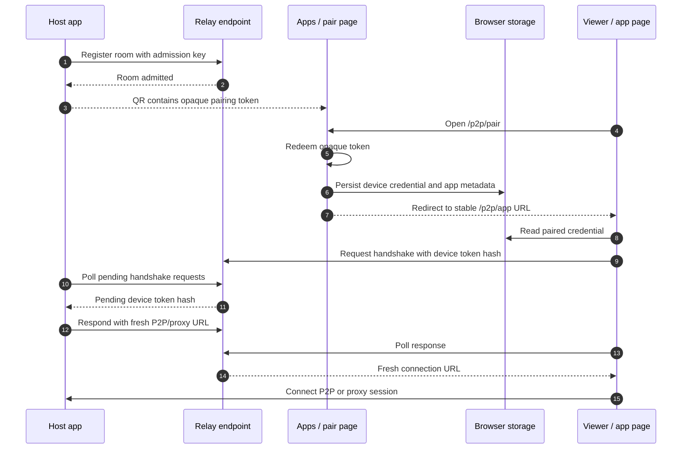

# P2P Pairing Workflow

The P2P workflow separates generic transport from product policy. `llming-com`
owns the pairing, admission, relay, viewer, and proxy primitives. A product such
as OpenHort supplies API keys, endpoint configuration, host-app registration, and
business-specific policy.



## Responsibilities

| Layer | Owns |
| --- | --- |
| `llming-com` | Opaque pairing token redemption shape, paired-device credential handling, relay HTTP/WebSocket contract, DataChannel proxy framing, generic browser viewer behavior, and deployment baselines such as Cloudflare Workers. |
| Product repo | Endpoint choice, API key provisioning, host app setup, UI branding, user/account policy, room limits, and commercial rules. |
| Browser app | Reads stored pairing credentials, initiates fresh handshakes, survives reload and phone sleep, and never depends on secrets in bookmarkable URLs. |

## URL Contract

QR URLs should be bootstrap-only and opaque:

```text
https://apps.example.com/p2p/pair#pt=<opaque-pairing-token>
```

After redemption, the pair page redirects to a stable page:

```text
https://apps.example.com/p2p/app
```

That stable page can be reloaded or bookmarked. It reads browser storage and
asks the relay for a fresh connection while the host app is still registered and
open for pairing.

## Security Baseline

- A host app must have an admission key before it can register a room.
- Anonymous room registration must be rejected.
- Pairing tokens should be short-lived and single-purpose.
- Persisted device credentials should support reload and phone sleep, with a
  configurable lifetime chosen by the product.
- Bookmarkable URLs must not contain app display metadata, device credentials,
  admission keys, or other secrets.

## Deployment Split

Cloudflare is one deployment backend under:

```text
llming_com/server/p2p/relay/cloudflare/
llming_com/server/p2p/apps/cloudflare/
```

Other relay/app deployment backends should live under the same server-role
layout instead of becoming top-level provider directories.
